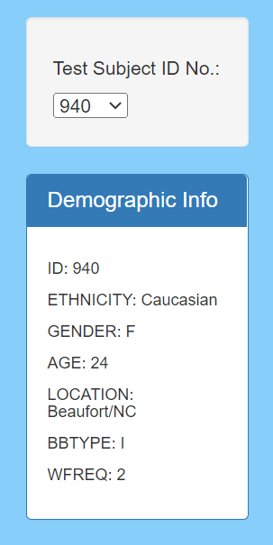
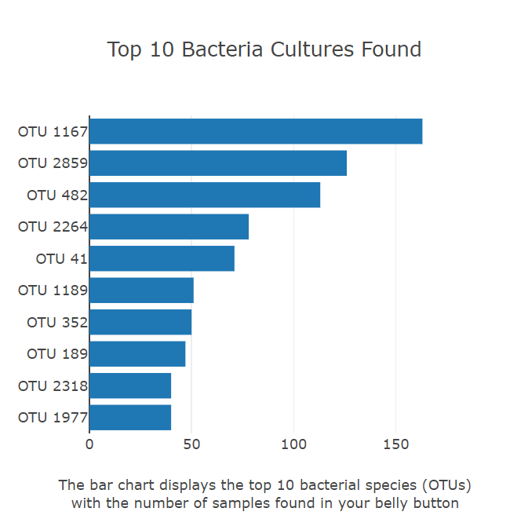
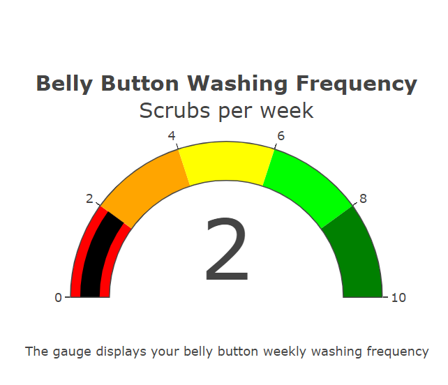

# plotly_deployment
## Project Overview
Purpose of this project was to build an interactive dashboard to visualize the results of a study conducted on bacterial species located in the navel of research volunteers.
## Results
* drop down menu containing volunteer ID and demographics

* bar chart featuring corresponding results of volunteer for top 10 microbial species 

* Bubble chart to show the samples concentrations and biodiversity of bacteria
!{belly_bubble](images/belly_bubble.PNG)

* Gauge displays the frequency of belly button washing weekly

## link to webpage
The interactive webpage is accessible at https://nataliecagno.github.io/belly_button
